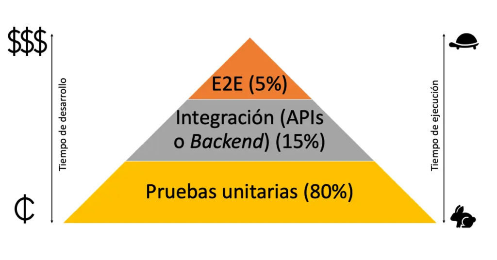

# Repaso
## DevOps
- Perfil devops vs Cultura devops
- Finalidad es tener todo el camino lo más automatizado posible
- Descripción de las distintas fases:
    - Code
    - Build
    - Test
    - Release
    - Deploy
    - Operate
    - Monitor
    - Plan


---

## Testing

### Piramide de Testing

Es un modelo antiguo, y a día de hoy existen modelos más actualizados pero sigue siendo la idea básica con más aceptación



#### E2E
 - Son los mas caros (en cuanto a recursos) de ejecutar y también de mantener
 - ...

#### Integración
 - Son necesarios para comprobar que los componentes desarrollados interactúan de forma correcta entre ellos
 - ...


#### Unitarios
 - Son básicos para evitar errores de regresión
 - ...


### Cypress

- Es un framework de testing E2E para aplicaciones web.
- Está basado en javascript y utiliza Mocha y Chai para la aserción
- Es uno de los frameworks E2E más populares porque tiene bastante buen rendimiento, es fácil de usar y es fácil de adaptar a diferentes tipos de proyectos
- Aunque su función principal es el testing E2E, también se puede usar para comprobar la accesibilidad del usuario y para medir el rendimiento

La documentación oficial de Cypress está en <https://docs.cypress.io/>

#### Interfaz gráfica de Cypress
(La idea es haber usado cypress y saber que puedes hacer con su interfaz)

#### Desarrollo de tests
(No hay que hacer desarrollos, pero si se mostrará código que habrá que entender que hace)<br>

Ejemplo más básico de test:
```javascript
describe('My First Test', () => {
  it('Does not do much!', () => {
    expect(true).to.equal(false)
  })
})
```
Importante:
 - estructurar los tests correctamente
 - mantener una jerarquía coherente
 - preparar el escenario necesario general
 - preparar el escenario necesario específico de cada test/conjunto de tests
 

---

## Automatización (github actions)

