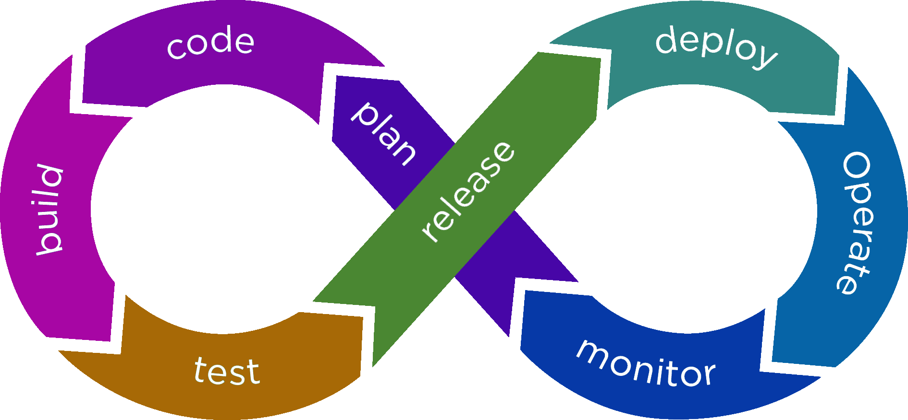
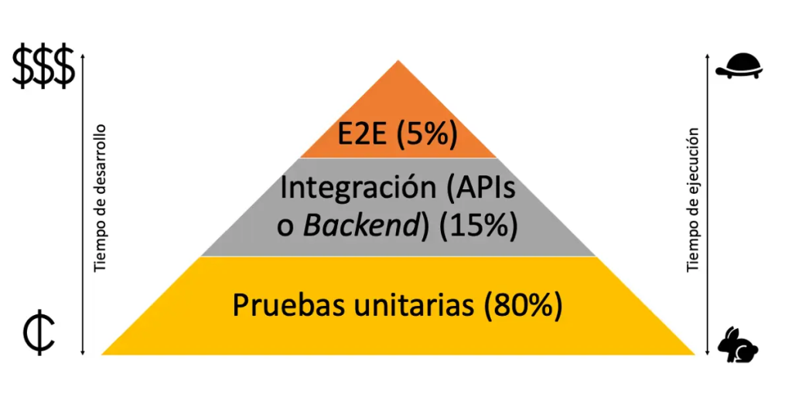

# Repaso

## DevOps

- Perfil devops vs Cultura devops
- La finalidad es tener todo el camino lo más automatizado posible



- Descripción de las distintas fases:
  - Plan: fase de toma de deciciones. Puede estar integrada con herramientas como Jira y se puede automatizar en cierta medida (tareas asociadas a presupuestos, firmas de responsables), pero depende de decisiones de negocio en última instancia
  - Code: esta fase consiste básicamente desarrollar y repositar el código fuente (github, gitlab, bitbucket ...)
  - Build: se compila el código y se repositan los artefactos generados ya sea en repositorios locales o globales (maven central, docker hub, npm ...)
  - Test: En esta fase se pueden lanzar todos los tipos de test de nuestro código y según los resultados hacer rollback o continuar
  - Release: se cierra una versión potencialmente desplegable y en cualquier caso pública para las máquinas de despliegue
  - Deploy: Se despliega en máquinas accesibles por los clientes la versión indicada
  - Operate: Este es el momento en el que la gente de operaciones comprueba y afina la automatización de la infraestructura (Infra-as-Code) necesaria para que el software funcione correctamente (terraform, kubernetes, ...)
  - Monitor: En esta fase se observa el funcionamiento de todo el conjunto y se obtienen metricas de uso útiles para adaptar nuestro producto (Prometheus, Grafana, Zabbix, ELK stack)

---

## Testing

### Pirámide de Testing

Es un modelo antiguo, y a día de hoy existen modelos más actualizados pero sigue siendo el modelo más conocido y en cualquier caso un modelo base del que partir con mucha aceptación



#### E2E

- Son los tests más cercanos y más parecidos al uso final, así que los posibles errores detectados serían los más apreciables por el usuario.
- Por otra parte son los mas caros (en cuanto a recursos) de ejecutar y también de mantener.

#### Integración

- Son necesarios para comprobar que los componentes desarrollados interactúan de forma correcta entre ellos


#### Unitarios

- Son los más extendidos porque son los más fáciles de hacer y de mantener
- No consumen muchos recursos ni de tiempo ni de infra para ejecutarlos
- Se pueden considerar incluso para modificar la manera de desarrollar, tomando los tests como punto de partida para el desarrollo (Test-Driven-Development)

### Cypress

- Es un framework de testing E2E para aplicaciones web.
- Está basado en javascript y utiliza Mocha y Chai para la aserción
- Es uno de los frameworks E2E más populares porque tiene bastante buen rendimiento, es fácil de usar y es fácil de adaptar a diferentes tipos de proyectos
- Aunque su función principal es el testing E2E, también se puede usar para comprobar la accesibilidad del usuario y para medir el rendimiento

Consulta la documentación oficial de Cypress que está en <https://docs.cypress.io/>

#### Interfaz gráfica de Cypress

(La idea es haber usado cypress y saber qué puedes hacer con su interfaz y cómo hacerlo)

#### Desarrollo de tests

(No habrá que hacer ningún desarrollo, pero si se mostrará código que habrá que entender y saber qué hace)

```javascript
// Ejemplo más básico de test
describe('My First Test', () => {
  it('Does not do much!', () => {
    expect(true).to.equal(false)
  })
})
```

Cosas a tener en cuenta en el desarrollo:

- estructurar los tests correctamente
- mantener una jerarquía coherente
- preparar el escenario general necesario
- preparar el escenario específico de cada test / conjunto de tests, si fuera necesario

---

## Automatización (github actions)

La parte de Github Actions que entrará serán los dos documentos que vimos en clase:

- [Inicio rápido:](https://docs.github.com/es/actions/quickstart) Para entender en la interfaz de Github donde podemos ver el funcionamiento de nuestro pipeline
- [Descripción de las Github Actions:](https://docs.github.com/es/actions/learn-github-actions/understanding-github-actions) Para entender los conceptos más importantes: workflows, jobs, runners, actions ... y entender el YAML donde definimos nuestro workflow
